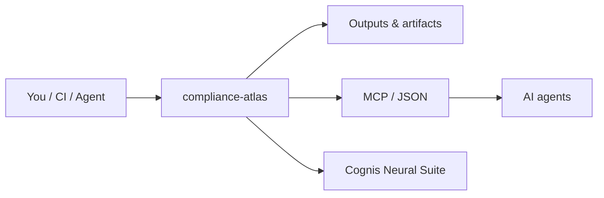

# compliance-atlas — a condensed, cross-walked map of the frameworks that matter

> Part of the **[Cognis Neural Suite](https://github.com/cognis-digital)** · COCL v1.0 · domain: `compliance`

A research-grade, **condensed** reference for the security & privacy frameworks teams actually get
asked about — each summarized to its essentials, with **crosswalks** showing how they overlap so you
implement once and satisfy many. Built from primary sources (linked in `SOURCES.md`).

> Not legal advice. Frameworks change — verify against the authoritative source before relying on this.

## Usage — step by step

1. Get the atlas — clone it, or install via the suite installer:
   ```bash
   git clone https://github.com/cognis-digital/compliance-atlas.git && cd compliance-atlas
   ./install.sh          # or: ./scripts/setup-linux.sh
   ```
2. Read a framework summary and its crosswalks (plain Markdown, no build step):
   ```bash
   less frameworks/soc2.md
   less crosswalks/soc2-iso27001.md
   ```
3. Implement once, satisfy many — start from the master matrix to find overlapping controls:
   ```bash
   less crosswalks/master-matrix.md
   ```
4. Expose the atlas to agents over the JSON/MCP integration (see `integrations/`):
   ```bash
   python integrations/webhook.py
   ```
5. In CI, treat the atlas as a versioned reference and lint it against `SOURCES.md`:
   ```bash
   ./scripts/lint.sh
   ```

## Frameworks covered

| File | Framework | TL;DR |
|---|---|---|
| `frameworks/soc2.md` | SOC 2 (TSC) | 5 Trust Services Criteria; attestation, not certification |
| `frameworks/iso-27001.md` | ISO/IEC 27001:2022 | ISMS + 93 Annex A controls; certifiable |
| `frameworks/nist-csf-2.0.md` | NIST CSF 2.0 | 6 functions (Govern/Identify/Protect/Detect/Respond/Recover), 22 categories |
| `frameworks/nist-800-53.md` | NIST 800-53 r5 | 1,196 controls / 20 families (federal) |
| `frameworks/nist-800-171.md` | NIST 800-171 | 110 controls / 14 families (CUI) |
| `frameworks/cmmc-2.0.md` | CMMC 2.0 | 3 levels; L2 = the 110 of 800-171 r2 |
| `frameworks/gdpr.md` | GDPR | EU personal-data law; privacy by design |
| `frameworks/ccpa-cpra.md` | CCPA/CPRA | California; thresholds + SPI class |
| `frameworks/hipaa.md` | HIPAA | US PHI; Privacy + Security Rules |
| `frameworks/pci-dss-4.0.md` | PCI DSS 4.0 | cardholder data; phishing-resistant MFA |
| `frameworks/eu-ai-act.md` | EU AI Act | 4 risk tiers; staged 2025–2028 timeline |

## Crosswalks

- `crosswalks/soc2-iso27001.md` — ~60–80% control overlap; reduces dual-audit effort up to ~40%.
- `crosswalks/nistcsf-80053.md` — CSF subcategory → 800-53 control mappings.
- `crosswalks/cmmc-800171.md` — CMMC L2 ≡ 800-171 r2 (110 controls).
- `crosswalks/master-matrix.md` — one table, all frameworks by theme.

See `SOURCES.md` for primary references.

## How it fits



**Explore the suite →** [🗂️ all tools](https://github.com/cognis-digital/cognis-neural-suite) · [⭐ awesome-cognis](https://github.com/cognis-digital/awesome-cognis) · [🔗 cognis-sources](https://github.com/cognis-digital/cognis-sources)

## Interoperability

`{}` composes with the 300+ tool Cognis suite — JSON in/out and a shared
OpenAI-compatible `/v1` backbone. See **[INTEROP.md](INTEROP.md)** for the
suite map, composition patterns, and reference stacks.
