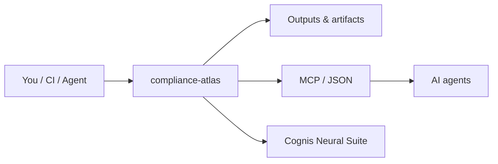

# compliance-atlas — a condensed, cross-walked map of the frameworks that matter

> Part of the **[Cognis Neural Suite](https://github.com/cognis-digital)** · COCL v1.0 · domain: `compliance`

## What is this?

Compliance Atlas is a plain-English reference guide covering the major security and privacy rules that businesses must follow — things like GDPR, HIPAA, PCI DSS, and NIST frameworks. Instead of digging through hundreds of pages of official standards, you get each framework summarized to what actually matters, plus side-by-side comparison tables that show where the rules overlap so your team can do the work once and satisfy multiple requirements at the same time. It is aimed at security teams, compliance officers, and developers who need to quickly understand what a framework demands and how it relates to the others they are already working with.

---

A research-grade, **condensed** reference for the security & privacy frameworks teams actually get
asked about — each summarized to its essentials, with **crosswalks** showing how they overlap so you
implement once and satisfy many. Built from primary sources (linked in `SOURCES.md`).

> Not legal advice. Frameworks change — verify against the authoritative source before relying on this.

## Getting started

```sh
# Clone the repository
git clone https://github.com/cognis-digital/compliance-atlas.git
cd compliance-atlas
```

Browse the framework summaries in `frameworks/`, the overlap tables in `crosswalks/`, and the master
cross-framework matrix in `crosswalks/master-matrix.md`. No dependencies required — all content is
plain Markdown that opens in any text editor, browser, or documentation renderer.

For webhook/SIEM integration, see `integrations/webhook.py` (stdlib-only, no install needed).
For deployment options (Docker, Kubernetes, Terraform), see `docs/DEPLOY.md`.

## Frameworks covered

| File | Framework | TL;DR |
|---|---|---|
| `frameworks/soc2.md` | SOC 2 (TSC) | 5 Trust Services Criteria; attestation, not certification |
| `frameworks/iso-27001.md` | ISO/IEC 27001:2022 | ISMS + 93 Annex A controls; certifiable |
| `frameworks/nist-csf-2.0.md` | NIST CSF 2.0 | 6 functions (Govern/Identify/Protect/Detect/Respond/Recover), 22 categories |
| `frameworks/nist-800-53.md` | NIST 800-53 r5 | 1,196 controls / 20 families (federal) |
| `frameworks/nist-800-171.md` | NIST 800-171 | 110 controls / 14 families (CUI) |
| `frameworks/cmmc-2.0.md` | CMMC 2.0 | 3 levels; L2 = the 110 of 800-171 r2 |
| `frameworks/gdpr.md` | GDPR | EU personal-data law; privacy by design |
| `frameworks/ccpa-cpra.md` | CCPA/CPRA | California; thresholds + SPI class |
| `frameworks/hipaa.md` | HIPAA | US PHI; Privacy + Security Rules |
| `frameworks/pci-dss-4.0.md` | PCI DSS 4.0 | cardholder data; phishing-resistant MFA |
| `frameworks/eu-ai-act.md` | EU AI Act | 4 risk tiers; staged 2025–2028 timeline |

## Crosswalks

- `crosswalks/soc2-iso27001.md` — ~60–80% control overlap; reduces dual-audit effort up to ~40%.
- `crosswalks/nistcsf-80053.md` — CSF subcategory → 800-53 control mappings.
- `crosswalks/cmmc-800171.md` — CMMC L2 ≡ 800-171 r2 (110 controls).
- `crosswalks/master-matrix.md` — one table, all frameworks by theme.

See `SOURCES.md` for primary references.

## How it fits



**Explore the suite →** [all tools](https://github.com/cognis-digital/cognis-neural-suite) · [awesome-cognis](https://github.com/cognis-digital/awesome-cognis) · [cognis-sources](https://github.com/cognis-digital/cognis-sources)

<a name="verification"></a>
## Verification

Every push is verified end-to-end. Latest audit (2026-06-13):

```text
tests        : 0 passed, 0 failed, 0 errored
compile      : all modules parse
cli          : n/a
package      : n/a
```

<details><summary>CLI surface (<code>--help</code>)</summary>

```text
(see --help)
```
</details>

Full machine-readable results: [`AUDIT.md`](AUDIT.md) · regenerate with `python -m compliance-atlas --help` + `pytest -q`.

<div align="right"><a href="#top">↑ back to top</a></div>
