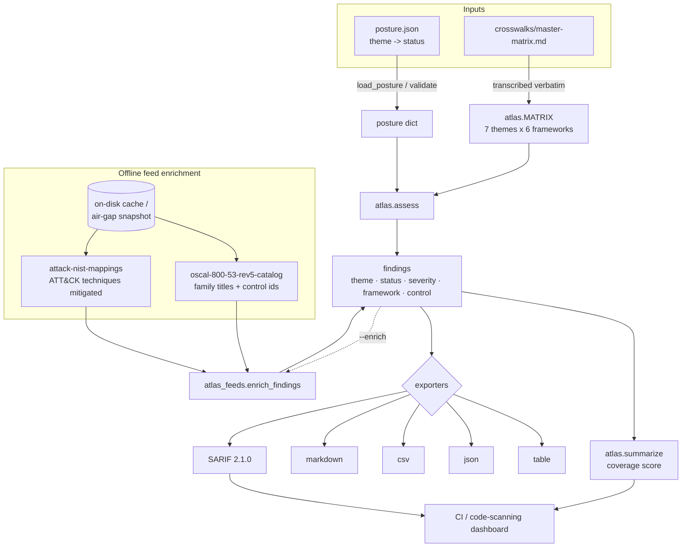

# Architecture

`compliance-atlas` is a small, pure-standard-library tool with one job: take a
hand-transcribed **crosswalk matrix** of control themes and let you run it as an
actionable, CI-gateable gap report — optionally enriched with **real public
feeds** (NIST 800-53 OSCAL + CTID ATT&CK), fully offline for air-gapped sites.

There is no database, no service, no network requirement. Everything is a pure
function over JSON, which is why the same code path drives the CLI, the demos,
and the tests.

## Components

| Module / file | Role |
|---|---|
| `crosswalks/master-matrix.md` | The source of truth: 7 control **themes** × 6 frameworks (SOC 2, ISO 27001, NIST CSF 2.0, 800-53 r5, 800-171, PCI DSS 4.0). |
| `atlas.py` | `MATRIX` (transcribed verbatim from the doc) + the assessor: `load_posture` → `assess` → `summarize` → exporters (`table`/`json`/`csv`/`markdown`/`sarif`). The `assess` / `matrix` / `frameworks` / `feeds` CLI. |
| `atlas_feeds.py` | Wires the bundled feed layer to *this repo's two compliance feeds only*: resolves 800-53 family **titles** (OSCAL) and counts ATT&CK **techniques mitigated** (CTID crosswalk). |
| `datafeeds.py` + `data_feeds_2026.json` | Stdlib feed engine: keyless fetch → on-disk cache → offline re-serve → air-gap snapshot import/export. |
| `frameworks/*.md`, `crosswalks/*.md` | The condensed, human-readable reference summaries and pairwise crosswalks. |
| `demos/NN-name/` | Worked `posture.json` + `SCENARIO.md` pairs (real situations). |
| `demos/*.py` | Runnable, narrated scenarios that drive the **real** API end to end (see [DEMOS.md](DEMOS.md)). |

## Data flow

## Design choices

- **Assess-by-default.** A theme absent from a posture is scored `missing`, not
  skipped — silence is a gap. An empty posture honestly returns 0% coverage.
- **Deterministic output.** `assess` sorts by `(severity, theme order, framework
  order)`, so diffs in CI are stable and an auditor sees the same rows every run.
- **No invented requirements.** Every framework reference printed is lifted
  verbatim from `master-matrix.md`; a test (`test_matrix_matches_master_matrix_doc`)
  enforces that the module never drifts from the doc.
- **Offline-first feeds.** Enrichment reads only the two compliance feeds, from a
  local cache; `--offline` never touches the network, and a snapshot moves the
  cache across an air gap by sneakernet. Tests (and demo 04) run with zero network
  against `tests/fixtures/cache/`.
- **One code path.** CLI, demos, and tests all call the same `assess` / `summarize`
  / exporter / `enrich_*` functions — there is no demo-only or test-only logic.
